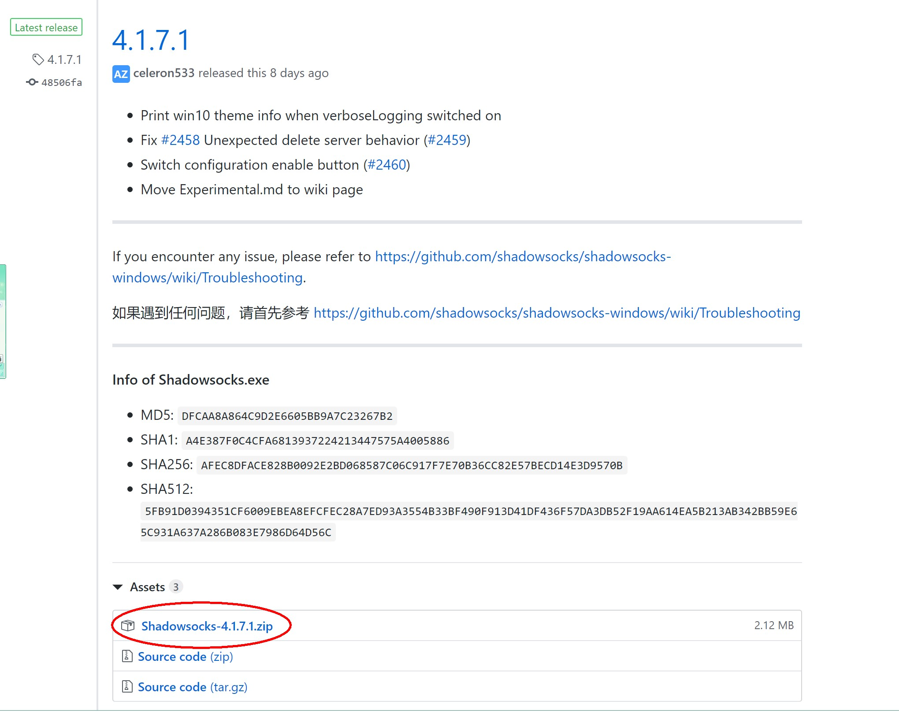
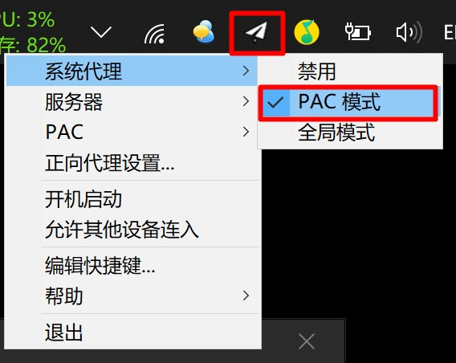

# Linux搭建Shadowsocks服务器教程

## 安装前准备


### CentOS

```
sudo yum install vim wget git gcc gcc-c++ libev-devel -y
```


### ubuntu

```
sudo apt-get install vim wget git gcc g++ lib-dev -y
```


---


## 第一步:一键安装Shadowsocks


```
wget --no-check-certificate -O shadowsocks.sh https://raw.githubusercontent.com/teddysun/shadowsocks_install/master/shadowsocks.sh && chmod +x shadowsocks.sh && ./shadowsocks.sh 2>&1 | tee shadowsocks.log
```

- 安装过程中分别要输入密码,端口号,和选择加密方式
- 端口建议大于10000,防止与其他软件冲突


## 第二步:一键安装并启动obfs加速


```
cd /usr/src;sudo yum install gcc autoconf libtool automake make zlib-devel openssl-devel asciidoc xmlto;git clone https://github.com/shadowsocks/simple-obfs.git;cd simple-obfs;git submodule update --init --recursive;./autogen.sh;./configure --disable-documentation;make && make install
```


## 第三步:安装BBR加速


```
cd /usr/src && wget -N --no-check-certificate "https://raw.githubusercontent.com/chiakge/Linux-NetSpeed/master/tcp.sh" && chmod +x tcp.sh && ./tcp.sh
```

- 在弹出的界面选择1(安装BBR魔改版内核),安装完成后会提示重启,输入Y重启


## 第四步:启动BBR加速


```
cd /usr/src && ./tcp.sh
```

- 在弹出界面选择使用BBR魔改版内核加速.


## 恭喜,到这一步你就安装完成了.

---

---


# 客户端的使用

---


## windows端


- 打开这网址

```
https://github.com/shadowsocks/shadowsocks-windows/releases
```


-下载客户端(点击圈中的客户端)




- 解压下载好的压缩包,并双击打开

- 在对应的位置输入之前搭建好的服务器信息
- 


- 右键任务栏上的小飞机--->系统代理--->PAC模式

  


## 好了，可以开始愉快地玩耍了